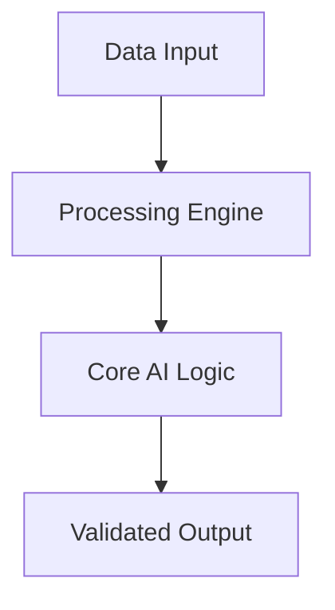

# 🚀 Semantic Document Parser

Advanced NLP engine for semantic parsing and structured data extraction from heterogeneous documents.

## 🏗️ Architecture

## 🌟 Features
- High-performance algorithms
- Modular & Scalable design
- Automated MLOps integration

Developed by **Marcos Garcia** (Lead AI Engineer).